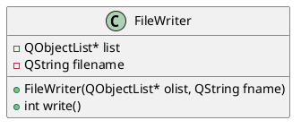

# Assignment 1 - Question 2

## Question
This question tests the concepts of reflection and meta-objects.
Extend the application you wrote in question 1 by adding a class named FileWriter as described
in the UML class diagram below:



The write() function should use the meta-object of the items in list to write each item’s type of
vehicle, properties and their values to a text file named in filename. You should use reflective
programming techniques to do this, and should not use the getters or the toString() functions
to extract the type of vehicle and the data from each item in the list. Thus you cannot assume
that you know what properties an item holds. The function should return the number of items
that were written to file.
From main(), create an instance of the FileWriter class, passing the list of vehicles (as a
QObjectList) and a file name, and then write the list to file. Display the number of records
printed to the console.

## Build and Run
This project uses CMake and Qt6 (Core).

Build:

```bash
# From assignment_1/q2
cmake -S . -B build
cmake --build build
```

Run the executable:

```bash
./build/q2
```
