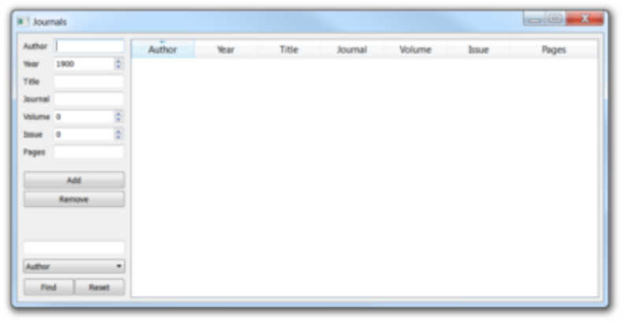

# Assignment 1 - Question 3

## Question
This question focuses on model-view programming.
A reference for a journal article needs the following data: the author, year of publication, article
title, journal name, volume and issue numbers, and the pages on which the article can be found.
Using a QStandardItemModel and an appropriate view, create a database for journal articles.
The user should be able to do the following:

* Sort on any column in view.

* Add data to the database.

* Remove data from the database.

* Filter the database on any of the fields (except the page numbers). The user should be
able to provide a wildcard filter and select which field to filter the database on. Then
only fields that meet the requirements should be displayed. There should also be an
option to clear the filter so that all records are displayed again.

Additionally, a year value later than the current year should not be allowed (and you can decide
how you will deal with situations where this is attempted). Also, if a reference is older than 10
years, highlight the row in red; if within the last 5 years, highlight in green. Note that you
cannot assume that the current year is 2025.
Note further that if the year should be changed in the view, it should not be allowed to be later
than the current year, and the highlight colour of the row should still change appropriately.
Below is an example of a possible interface:



## Build and Run
This project uses CMake and Qt6 (Widgets).

Build:

```bash
# From assignment_1/q3
cmake -S . -B build
cmake --build build
```

Run the executable:

```bash
./build/q3
```
