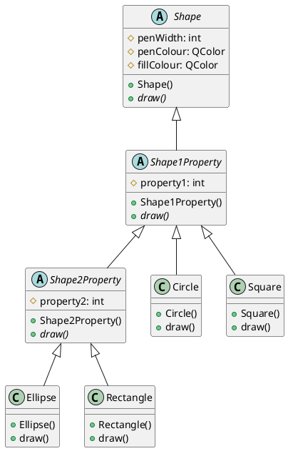
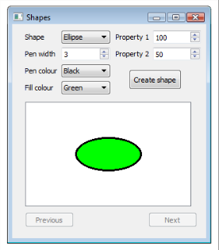

# Assignment 2 - Question 1

## Question
One way to draw a set of shapes (squares, circles, rectangles, and ellipses) is to use an
inheritance hierarchy similar to the one below. The base class holds basic pen and brush
values, and subclasses hold a number of additional properties (squares and circles need one
property - the radius of a circle for example, whereas rectangles and ellipses need
an additional property - length and width of the two sides of a rectangle, for
example). The Shape, Shape1Property (for circles and squares), and Shape2Property (for
ellipses and rectangles) classes are abstract classes (the draw() function being the pure virtual function in all of them).



Use this structure to create an application that will draw the required shape in a GUI
window. The UML diagram gives only the basic structure, and you will need to add getter and
setters, other constructors, and helper functions as you need them.



Note that if you cannot get the image to appear, you should at least display the shape
properties in a GUI window so that the following three questions can also be completed.

## Build and Run
This project uses CMake and Qt6 (Widgets).

Build:

```bash
# From assignment_2/q1
cmake -S . -B build
cmake --build build
```

Run the executable:

```bash
./build/q1
```
