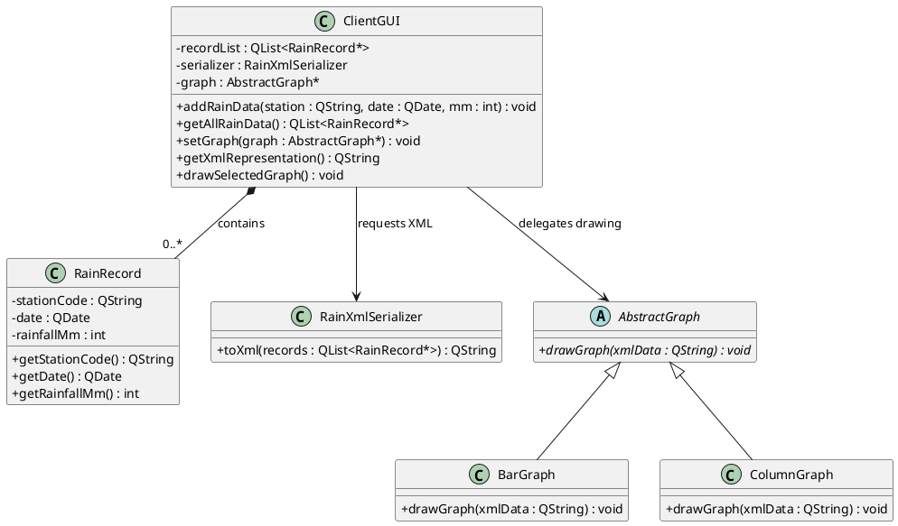

# Question 1

## 1.1

The partial UML class diagram is shown below.



## 1.2

Yes. The pattern used is the **Strategy** pattern, which is a **behavioural** pattern.

It is behavioural because the key variation is in behaviour (how the graph is drawn), not in object structure or object creation.

## 1.3

The class definition is shown below.

```cpp
class RainRecord : public QObject
{
    Q_OBJECT
    Q_PROPERTY(QString data READ getData)

private:
    QString stationCode;
    QDate date;
    int rainfallMm;

    QString getData() const;
};
```

# Question 2

## 2.1

```cpp
QString dateStr = date.toString("yyyy/MM/dd");
```

## 2.2.1

```cpp
class RainXml
{
public:
    static RainXml& getInstance();
    QString writeToXml(/*passing rain data*/);

private:
    RainXml();
    static RainXml* instance;
    bool checkStationCode(QString stn) const;
    QRegularExpression re;
};
```

What was wrong with the given class definition:
- `getInstance()` was not `static`, so you would already need an object before you could call it.
- `getInstance()` returned by value, which allows copies instead of one shared instance.
- `RainXml instance;` was a non-static data member which makes the class contain itself.
- The constructor was public, so multiple instances could still be created directly.

## 2.2.2

I would **not** agree with making `RainXml` a singleton in this case.

A singleton is justfied when:

* There must be exactly one instance
* The instance represents a share touchpoint for co-ordination or state
* Multiple instances would cause incorrect behaviour.
* Global access is needed

None of these requirements apply to `RainXml`, since it is just a simple serializer. Since it is lightweight, there is no reason why multiple instances cannot be created. Calls to its methods do not require co-ordination with other classes or access to shared state. Having multiple instances does not cause incorrect behaviour. Global access is not needed, since only the client class needs to use it.

## 2.3.1

```cpp
QRegularExpression re("^([A-Z])[a-z][a-z]\\1[1-9]\\d{2}$");
```

Explanation:
- `^` anchors the match to the start of the string, so no characters before the code.
- `([A-Z])` captures the first uppercase letter.
- `[a-z][a-z]` matches the next two lowercase letters.
- `\1` requires the same uppercase letter captured at the start.
- `[1-9]` ensures the first digit of the numeric part is not zero.
- `\d{2}` matches the remaining two digits.
- `$` anchors the match to the end of the string, so no characters after the code.

## 2.3.2

The anti-pattern is **Input kludge**.

If station codes are not validated at input time, invalid values enter the workflow and later code tends to add ad-hoc fixes/special cases to cope with bad data.

## 2.3.3

```cpp
bool RainXml::checkStationCode(QString stn) const
{
    QRegularExpressionMatch match = re.match(stn);
    return match.hasMatch();
}
```

## 2.4

```cpp
QString RainXml::writeToXml(/*passing rain data*/)
{
    QString xmlOutput;
    QXmlStreamWriter writer(&xmlOutput);

    writer.setAutoFormatting(true);
    writer.writeStartDocument();
    writer.writeStartElement("rainRecord");

    // loop through each rain pointer named r (do not code this)
    for (/* each rain record pointer r */) {
        // use the meta-object to get the required data
        const QMetaObject* mo = r->metaObject();
        int dataPropIndex = mo->indexOfProperty("data");
        QString rawData = mo->property(dataPropIndex).read(r).toString();

        QStringList parts = rawData.split(':');
        if (parts.size() != 3) {
            continue;
        }

        QString station = parts.at(0).trimmed();
        QString dateRaw = parts.at(1).trimmed();
        QString mm = parts.at(2).trimmed();

        // if the station code passes the test
        if (checkStationCode(station)) {
            QDate d = QDate::fromString(dateRaw, "yyyy/MM/dd");
            if (!d.isValid()) {
                continue;
            }

            // set up the <rain> tag and its sub-tags as required
            writer.writeStartElement("rain");
            writer.writeAttribute("date", d.toString("yyyy/MM/dd"));
            writer.writeTextElement("station", station);
            writer.writeTextElement("mm", mm);
            writer.writeEndElement();
        }
    }

    // end xml text
    writer.writeEndElement();   // rainRecord
    writer.writeEndDocument();

    return xmlOutput;
}
```

# Question 3

## 3.1

```cpp
class StationThread : public QObject
{
    Q_OBJECT

public:
    StationThread(const QList<RainRecord*>& allData,
                           QString stn);

public slots:
    void doSearch();

signals:
    void foundStation(QString date, QString mm);
    void finished();

private:
    QList<RainRecord*> record;
    QString station;
};
```

## 3.2

```cpp
st->moveToThread(t);

connect(t, &QThread::started,
        st, &StationThread::doSearch);

connect(st, &StationThread::foundStation,
        this, &Client::handleFound);

connect(st, &StationThread::finished,
        t, &QThread::quit);
connect(st, &StationThread::finished,
        st, &QObject::deleteLater);
connect(t, &QThread::finished,
        t, &QObject::deleteLater);

t->start();
```

This assumes that `StationThread::doSearch()` emits `finished()` when processing completes, so the `finished` connections can quit and clean up the thread/worker.

## 3.3

Its not the best approach.

`QTableWidget` is acceptable for a small, simple table because it convenient, but it is item-based and tightly couples domain data storage to the UI widget. For this scenario, a model/view approach with `QTableView` and seperate domain model class is better because it scales more cleanly, separates data from presentation, and is easier to update/refresh when thread results arrive. With `QTableView` and a model, thread results can be appended to model data, and the view refresh is handled through model notifications. That gives cleaner, safer update flow.

## 3.4.1

The classic Memento pattern has three components:
- **Originator**: the object whose state is saved/restored.
- **Memento**: the snapshot object that stores the originator state.
- **Caretaker**: the object that keeps mementos and decides when to save/restore.

In this scenario:
- `MyTableWidget` is the **Originator**.
- `MyTableWidgetMemento` is the **Memento**.
- `Client` is the **Caretaker**.

## 3.4.2

It is not correct. The problematic areas are:

- `friend class MyTableWidgetMemento` is the wrong direction for classic Memento encapsulation. We need the Originator (`MyTableWidget`) to access private state inside the Memento, not for the Memento class to access the Originator’s private members.
- `createMemento()` and `setMemento(...)` are private, so the Caretaker (`Client`) cannot call them to save/restore. It should be the `getState()` and `setState()` methods of the Momento that are private.
- The constructor of the Originator is private, which makes normal widget creation impossible. It should be the constructor of the Momento (`MyTableWidgetMemento`) that is private so that the Caretaker cannot access the state of the Originator.

## 3.5

Cloud computing is a good choice for this rainfall system in terms of **cost** and **scale**.

For cost, cloud services are usually billed on a pay-as-you-go basis, so the organization pays for what it uses rather than buying and maintaining full infrastructure capacity upfront. This helps reduce initial expenditure and ensures operating costs reflect actual usage. [[2]](#references) [[3]](#references)

For scale, cloud platforms are designed for elastic resource allocation. So they can scale up during heavy demand and scale down during low demand, which is useful for our workload since rainfall varies by season and region, and reporting load may vary too. [[1]](#references) [[3]](#references)

# References

1. [1] https://en.wikipedia.org/wiki/Cloud_computing
2. [2] https://azure.microsoft.com/en-us/overview/what-is-cloud-computing/
3. [3] https://www.ibm.com/cloud/learn/cloud-computing
